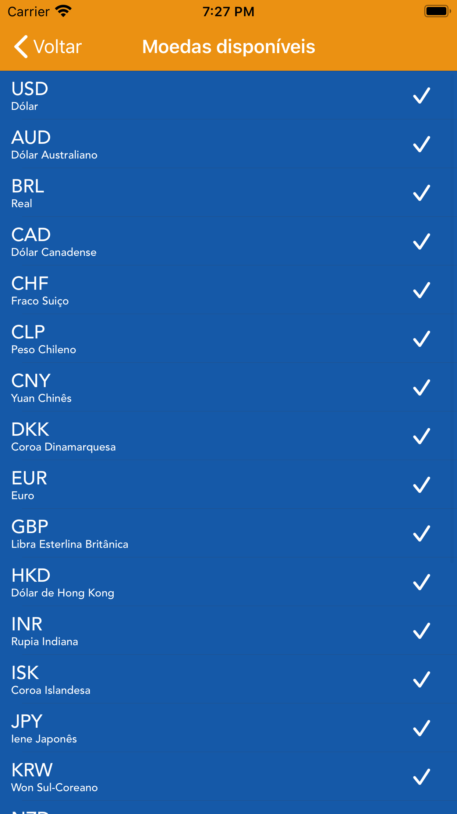

# bitcoin-converter
É um app de consulta do valor de um bitcoin para as sequintes moedas: 

* USD -> Dólar
* AUD -> Dólar Australiano
* BRL -> Real
* CAD -> Dólar Canadense
* CHF -> Franco Suiço
* CLP -> Peso Chileno
* CNY -> Yuan Chinês
* DKK -> Coroa Dinamarquesa
* EUR -> Euro
* GPB -> Libra Esterlina Britânica
* HKD -> Dólar de Hong Kong
* INR -> Rupia Indiana
* ISK -> Coroa Islandesa
* JPY -> Iene Janopnês
* KRW -> Won Sul-Coreano
* NZD -> Dólar Neozelandês
* PLN -> Zloti Polaco
* RUB -> Rublo Russo
* SEK -> Coroa Sueca
* SGD -> Dólar Singapuriano
* THB -> Bath Tailandês
* TRY -> Lira Turca
* TWD -> Novo Dólar Taiwanês

---
<h2 align="center">

</h2>

## 📌 Support

- Twitter at [@fbw_] (https://twitter.com/fbw_)
- Instagram at [@felipeweber] (https://www.instagram.com/felipeweber)
- Linkedin at [@felipebweber] (https://www.linkedin.com/in/felipebweber)
- Twitch at [@felipebweber] (https://www.twitch.tv/felipebweber)

## 📝 License

This project is licensed under the MIT License - see the [LICENSE](LICENSE) file for details.