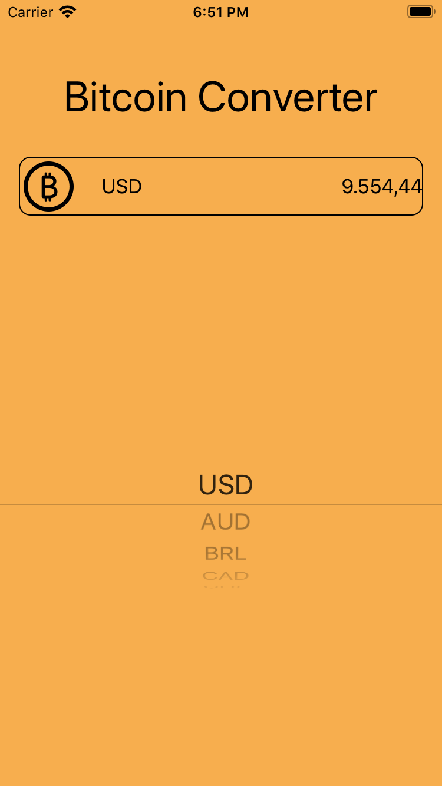
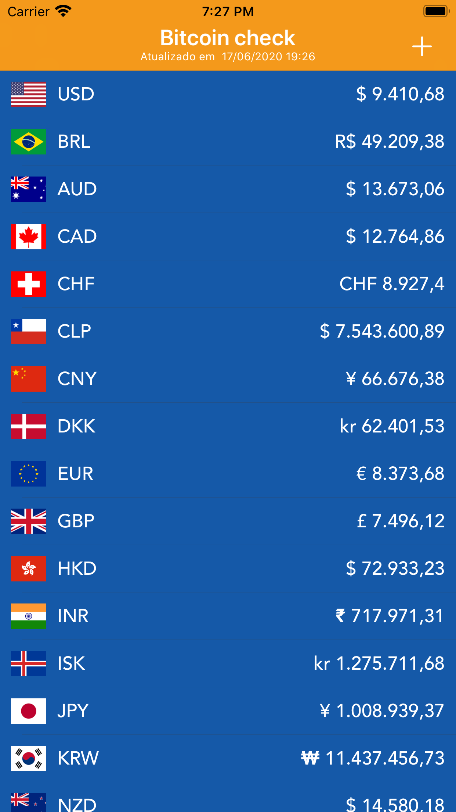

# bitcoin-converter
É um app de consulta do valor de um bitcoin para as sequintes moedas:

* USD -> Dólar
* AUD -> Dólar Australiano
* BRL -> Real
* CAD -> Dólar Canadense
* CHF -> Franco Suiço
* CLP -> Peso Chileno
* CNY -> Yuan Chinês
* DKK -> Coroa Dinamarquesa
* EUR -> Euro
* GPB -> Libra Esterlina Britânica
* HKD -> Dólar de Hong Kong
* INR -> Rupia Indiana
* ISK -> Coroa Islandesa
* JPY -> Iene Japonês
* KRW -> Won Sul-Coreano
* NZD -> Dólar Neozelandês
* PLN -> Zloti Polaco
* RUB -> Rublo Russo
* SEK -> Coroa Sueca
* SGD -> Dólar Singapuriano
* THB -> Bath Tailandês
* TRY -> Lira Turca
* TWD -> Novo Dólar Taiwanês

## Primeira versão
---
<h2 align="center">

</h2>

## Segunda versão
---
<h2 align="center">

</h2>

Segunda versão do App possui duas telas. Uma onde é possivel selecionar quais moedas quer saber o valor do Bitcoin e outra onde é a visualização das moedas selecionadas.

Características:
- O app possui layout responsivo para os diferentes tamanhos de tela.
- A formatação das moedas levam em conta a localização do usuário definida nos ajustes do iPhone.
- Possui suporte para a linguagem pt-br e en.
- O usuário pode favoritar quais moedas quer saber o valor do Bitcoin.
- Pull refresh;
- É possível apagar as moedas selecionadas direto na View principal.

Definições de projeto:
- Para requisição dos dados foi utilizado a biblioteca Alamofire. 
- Os dados das moedas como valor, símbolo da moeda e abreviação da moeda foi salvo utilizando banco de dados.
- As preferências do usuário com as moedas favoritas foi salvo utilizado UserDefaults.
- O projeto usa a arquitetura MVC.

## 🔖 API
https://blockchain.info/ticker

## 📌 Support

- Twitter at [@fbw_] (https://twitter.com/fbw_)
- Instagram at [@felipeweber] (https://www.instagram.com/felipeweber)
- Linkedin at [@felipebweber] (https://www.linkedin.com/in/felipebweber)
- Twitch at [@felipebweber] (https://www.twitch.tv/felipebweber)

## 📧 Contact

- Email at weberecomp@gmail.com

## 📝 License

This project is licensed under the MIT License - see the [LICENSE](LICENSE) file for details.
